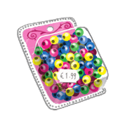
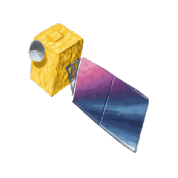
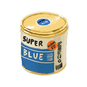
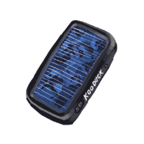
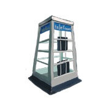
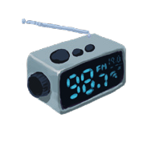
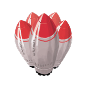
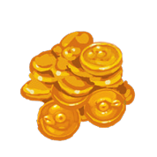
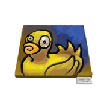

# DUCK DEALER

Rules

### **DUCK DEALER**

As he walks to his spaceship, he hears a soft sound that sounds like muffled crying. He turns around, once more, and smiles at his wife. "I'll be back in no-time. Just selling these old rubber duckies on the next space station and that'll be all". But they both know it's not true. Because if it were, what would all that blue paint and satellite equipment in the ships cargo holds be for? And why would he have needed to outfit his once-modest scout class ship with heavy duty construction equipment? "I know you're doing this to make us all proud", his wife says, trying to smile through her tears. "I just hope this time the plan will work out". "Don't worry, my love" he answers. "I've got everything under control".

But they both know...

Duck Dealer is a game of involved, complex planning, set against a background of intergalactic trade. It is a game about recognizing routes, and developing profitable infrastructures; but above all, it's a game of racing your opponent to that one great opportunity you both see-- or does he have a different plan?

### **GAME OVERVIEW**

The object of the game is to amass riches by buying and selling plastic beads, yellow rubber ducks, blue paint, and other innovative high-tech materials to hapless consumers across the universe.

Players take turns. Most turns will be very quick as players focus on collecting enough energy to realize their plans. From time to time, a player will burst into action, fly around the universe, and, hopefully, gain more money than his opponents...

Over the course of the game, players improve their spaceship, adding extra gear and cargo space. As they explore the galaxy, new centers of production rise to prominence, trade routes are changed, and money is made by different tricks...

# **GAME MATERIALS**

### · Goods:

 

primary: yellow rubber ducks, plastic beads, solar panels, blue paint, phone boxes

\*\*Output:\*\*
The image depicts multiple blue capsules displayed against a neutral background. While some are fully shown and others only partly, all share an oval form with distinct segmentation lines across their middle.

3-point intermediate goods: satellites, linear accelerators, stealth ducks, modern radio, diet pills

10-point final goods: economics, modern art, science

30-point final goods: religion, politics, medicine, military

# · Four types of economy counters:

Mines produce primary goods. Five of the mines have a border indicating they should be put on the starting planets.

Image /page/2/Picture/25 description: The image contains a blue background with three distinct sections arranged horizontally. On the left side, there is an illustration of a yellow rubber duck above two red batteries positioned vertically within a brown rectangular frame. In the middle section, separated by black arrows pointing to the right, and on the rightmost part stands a gray portable radio with large round speakers.

Factories can transform input goods into other goods.

Image /page/2/Picture/27 description: A yellow sign with a blue bucket icon on the left side of it.

Image /page/2/Picture/28 description: The image features a purple background with three main elements on the left side of it. The top element is an icon resembling headphones in blue color inside a white box followed by a right-pointing black arrow and then there's another rectangle which also contains some symbols or icons but are not clearly visible due to blurriness.

Spaceyards produce ship components if the right input goods are available.

Consumers allow players to make money (score points).

Spaceyards and consumers have a backside that is used to indicate when a site has not yet been built. Building factories, spaceyards and consumer sites scores points.

# Cargo hold counters:

Image /page/3/Picture/1 description: A solid black square with a thin gray border surrounding it.

used to build a cargo hold in a space ship.

### · Energy markers:

large wooden disks, 40 per color. These represent your action potential during the game. The colors correspond to an action type: red= movement; yellow= building; blue=trading.

### · Crew quarters:

if an energy marker disk is put on a spaceship, it functions as a crew quarter for either a navigator (red), a builder (yellow) or a merchant (blue). It will produce 1 energy of the corresponding type every turn the player owning the ship chooses to collect energy.

### · The board:

the board shows a lot of planets, connected by intergalactic trade routes. Each planet has 2-3 slots in which to place mines, factories, spaceyards, or consumers. Furthermore, the board shows a points track (1-100), a turn track (1-24) and slots on which to put unused consumer tiles.

### · Intergalactic highway parts:

wooden cubes, in player colors, 30 per player. These are placed on trade route dots in the game, and allow the corresponding player to skip that dot in movement. In addition, the player has to use one of these markers every time he takes a turn. Finally, one of the markers is also used to keep the player's score.

### · Factory privileges:

10 small wooden disks in each of the player colors. These are used to show that a player gets a discount when trading with factories, mines, spaceyards, or consumers.

### · Space Ships:

Image /page/3/Picture/14 description: The image depicts a green spaceship-like object with four protruding arms or engines on either side of its central body, set against a white background. The design suggests it is some form of futuristic vehicle or machine.

each player has 1 space ship, which consist of a pawn on the board (player color), and a corresponding placard on the table. Before playing the first time, the space ship pawns should be assembled (see picture). On the placard, players can put ship gear such as cargo hulls or crew quarters to accommodate Navigators, Merchants, or Builders. These are placed on the slots provided. The space ship placard also shows 1 small (half-size) cargo hold that is "built in" to the spaceship.

# · Schrödinger pathway markers:

Image /page/3/Picture/17 description: The image displays two identical panels side by side on a red background. Each panel features concentric circular patterns with dark lines radiating outward from the center towards their edges. A bold black arrow is prominently placed in each central area, pointing diagonally upwards to the right within its respective circle.

2 for each player, in the player colors. These are used to teleport from one planet to another.

# **PREPARATION**

- · Sort the energy markers by color and put them on the placard "Build/ Move/ Trade" on the corresponding color. Players do not yet get any action markers or goods.
- · Shuffle the 5 starting mines, and place them on the starting planets (one of the planets with only 2 slots). Shuffle the 5 spaceyards, and place them on the second slot of the starting planets (with the yellow, unbuilt side up).
- Shuffle the rest of the mines, and place one on each empty planet.
- · Shuffle the consumer tiles, and place them with their yellow side up on the consumer track as shown (3-point intermediate goods on top, then the 10-point final goods, and finally the 30-point final goods on the bottom).
- · Give each player one spaceship chart and a pawn; the intergalactic highway parts (wooden cubes) and factory privileges (small wooden disks) in his color; and two matching Schrödinger pathways.
- · The player born closest to November 24st, 1967, may start, play proceeds clockwise from there.
- · If players want to play competitively, they can use an auction: secretly bid a number of points by writing them on a piece of paper; whoever bids most may choose his playing position first, then the second highest bidder, etc. In case of a tie, the tied players have to bid again to determine their order relative to one another.

- In case of another tie, the birth date decides as per the previous rule. The points bid are written down and subtracted from the game score at the end of the game. Adjust seats so that play can proceed clockwise from the starting player.
- · Each player may freely place 3 items of ship gear (cargo hold, navigator, merchant, builder) in his space ship, on the slots marked "8". (Choose in player order if required).
- · In player order, each player then chooses a starting planet (one of the planets with only 2 slots). Two players cannot start on the same planet. The player puts his space ship pawn on this planet.

### **TURN ORDER**

Players take turns in clockwise order. On a turn, they can either collect energy, or take actions. They cannot do both (except in one exceptional situation detailed below). Players will normally take a number of collect energy turns before taking action. This means most of their turns will be really quick.

# **COLLECT ENERGY**

To collect energy, a player takes one energy marker of his choice: movement, build, or trade. In addition, each crew quarter (large wooden disk) in his ship produces an energy marker of the same type. E.g., if he has 2 navigator and 1 builder crew guarters, he gets 2 movement and 1 building energy marker in addition to his freely chosen energy marker.

This concludes the collect energy turn.

If one of the energy marker colors runs out (a player wants to or has to take a marker of a color that is no longer there), the player gets a free take action turn, which he has to take immediately following the collect energy turn. During this action turn, the player can use all energy markers he would normally have taken (even the ones that were no longer available). Use wooden cubes (or other available material) to keep track of these "virtual" energy markers. At the end of the action turn, only normal energy markers may be retained.

This is the only situation in which a player can collect (some) energy and take action in the same turn.

### **TAKE ACTION**

If a player chooses to take action, he does the following:

- He places one of his wooden cubes on the turn track on the main board. The wooden cube will remain there for the rest of the game. If this is turn 24, the game will end after his turn.
- He may then place one to three intergalactic highway parts in his own color on any dot on the board that does not contain a planet, another intergalactic highway part, or a space ship. The number of intergalactic highway parts he may place depends on the current turn as indicated on the turn track: one in turn 1-6; two in turn 7-12; and three in turn 13-24.

- He then can use between zero to all of his energy markers to move, build, and trade. This can be done in any order, e.g., buy something, move, build, buy, move, etc. The only limit is the number of energy markers the player has. The energy markers he spends go back to the common stock.
- At any time during his turn, the player may place both of his Schrödinger pathway markers, if he has not yet done so.
- After his action, the player can keep only 4 energy markers in storage. Any excess markers are returned to the common stock.

The wooden cubes, and the small wooden disks, have a limited stock. In case they run out, a player may take a privilege or a highway part of his colour that is already on the board and use that instead. The player has to provide a cube for the turn track (using a highway part if necessary), and any cubes placed on that track must remain there.

### **MOVEMENT**

For each Movement (red) energy marker spent, a player may move his ship a number of steps. Each dot (comet) and each planet count as one step.

The number of steps a ship may move for one energy counter depends on the amount of ship gear (crew quarters or cargo holds) the ship hold: 8 steps if the ship has 3 slots filled (scout class ships), 5 for 4-6 slots filled (cruiser class ships), and 2 for ships with more than 6 slots filled (freighters).

Intergalactic highways. Any dots containing an intergalactic highway part of the player's color is skipped over, i.e., it does not count as a step. Note that planets can never contain a highway. Intergalactic highway parts of other players are counted normally.

Schrödinger pathways. If a player is on a planet with a Schrödinger pathway entrance, he can spend one movement energy marker to move to the corresponding (same color) Schrödinger exit. Using a pathway always costs exactly one energy marker—it is not possible to use the same energy marker for normal movement as well. Note that a player may use Schrödinger pathways placed by other players as well as his own.

**Midspace stops.** A player may end his movement on a dot in mid-space, or on a planet. Planets are the only places where he can do build or trade actions, so, most of the time, a player will try to move to a planet.

**Multiple ships.** A spaceship may end its turn on a dot containing another ship. Ships do not interact.

**Excess movement points.** It is allowed to use only part of the movement generated (i.e., take one step although you can move 8) to reach a planet. Any excess movement points are lost as soon as a player decides to do something on a planet.

**Exploration.** If a spaceship moves onto a planet that has not previously been visited, he discovers this planet. He chooses one of the top two consumer tiles from the consumer track and places it in the second slot of the planet, with the yellow unbuilt side up.

Exploration is obligatory if a player ends any part of his movement on a planet; if he has enough steps left from his energy marker, he can fly by a planet. In this case, he cannot explore, nor can he do anything else on the planet.

### BUILDING

A player may build things on the planet on which he has a space ship. Each planet may only contain one mine, one consumer tile and one factory. Starting planets contain a mine and a spaceyard.

To build a factory, spaceyard, or consumer tile, you pay one building energy marker to the bank (yellow), in addition to the needed goods.

Consumer tiles and spaceyards. You can build consumer tiles or spaceyards that have their unbuilt side up by handing in the goods indicated as small squares on the tiles. R (random) means any good will do, except for the good printed on the tile – you always need two different goods to build a spaceyard. This scores points as indicated on the tile. Turn the tile over to its blue side to indicate it has been built.

**Factories.** You can build a factory by paying the input goods for that factory. Take the factory from the stock and place it in the planet's factory slot. This scores points as indicated on the player aid. Note that there is a limited number of each type of factory.

**Privileges.** For three building energy markers, you can claim a mine on the planet that you are on, which has no privilege

marker yet. Simply put a privilege marker of your colour on that mine. Factories, space-yards and consumers can be claimed in the same manner.

Intergalactic highway. In addition to building on your current location, you can build intergalactic highway parts anywhere on the board. You have to pay one building energy marker per highway part. The highway parts (wooden cubes) can be placed on any dot (not planet) in the universe that does not contain a spaceship or another highway token.

### **TRADING**

A player may trade only on the planet on which he has a spaceship. Any trade costs 1 blue trade energy marker, in addition to a number of goods.

**Mines.** All planets have one mine. For each trade energy marker you spend, you may take one good produced in that planet's mine and put it on your ship.

Spaceyards. The starting planets all have a spaceyard, where you can buy ship gear: crew quarters that produces energy (put one energy marker of the corresponding color on your ship) or a cargo hold. Ship gear can only be acquired at the appropriate spaceyard. The spaceyard site must have been built (blue side up). The costs for ship gear are indicated on the tile- e.g., a cargo hold costs 1 phone box and 1 blue paint, in addition to a trade energy marker.

The new gear is placed in the ship and takes up a slot. If you build over the first "5" or "2" slot, your ships speed will be affected accor-

dingly. It is allowed to build ship gear into a slot that was already filled with other gear, in effect exchanging the gear (put the old gear back in the common stock). However, once a slot is filled, it can never be emptied again.

**Factories.** If a planet has a completed factory (blue side must be showing), you can use it to convert input goods into the shown manufactured product. For instance, at a diet pill factory you can hand in 1 blue paint, 1 plastic beads and a trade energy marker to make diet pills. Goods cannot be decomposed after they have been put together.

**Consumers.** If a planet has a completed consumer site (blue side must be showing), you can earn money (score points) by delivering the required good. Hand in a product of the type required at that planet, and 1 trade energy marker. You score points as indicated on the tile.

**Storing goods.** During the trade turn, you can own any number of goods, even if they do not fit in your cargo holds. However, as soon as you start moving, or when you end your turn, you can only store the goods that fit in your cargo space. Each cargo space can hold two goods. The small space printed in the middle of the space ship can hold one good.

**Discarding**. Goods can be freely discarded. They are placed back in the common pile.

**Trading with other players.** Goods can also be freely traded with players on the same planet. This does not cost any energy markers.

**Privileges.** If a player has placed a privilege on a mine, factory, spaceyard or consumer tile, he pays only one trade energy marker to use the tile as much as he wants: until his turn ends or he leaves the planet e.g., he can buy multiple items at a mine, or deliver multiple times to a consumer site. He still has to pay the input goods multiple times. Privileges do not prevent other players from using a tile.

# **SCHRÖDINGER PATHWAYS**

The Schrödinger pathways function as a teleport that can be used by all players on the board (see movement).

Once per game, a player can place his pathways at any time during his action turn. He places both the entrance and the exit. Both pathways must be placed on two different planets. No planet may contain more than one pathway (entrance or exit). Once placed, the pathways are fixed for the rest of the game, and can be used by any player.

# **WINNING THE GAME**

The game ends after the last action turn has been completed. Whoever has amassed the most riches wins the game.

# Game design:

Jeroen Doumen, Joris Wiersinga

### Graphic design:

Tooba Rezaei, Maral Karaee

### **Rule translations:**

Birgit Hugk, Torsten Hintz

### Published by: 5

plotter Spellen, Langestraat 22, Leiden, The Netherlands, info@splotter.nl, http://www.splotter.nl

# Thanks to the following people for play-testing this game:

Jeroen Doumen, Bianca van Duijl, Nora Ghaoui, Ferdy Hanssen, Ragnar Krempel, Michel Rosien, Henriëtte Verburg, Joris Wiersinga, Berend-Jan van der Zwaag.
